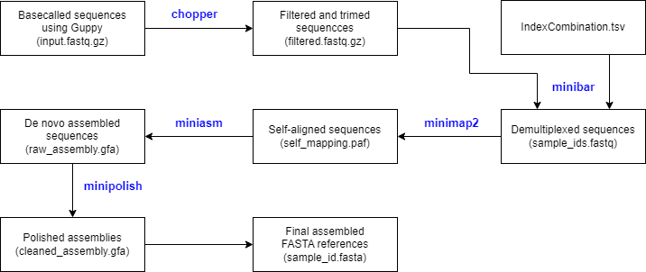

# Ref.creator


## Description
Ref.creator is a pipeline for the creation of de novo assembled reference files from basecalled long-read sequencing data. It efficiently handles demultiplexing, quality control, and assembly tasks. Designed to expand the [DuBa.flow Pipeline](https://github.com/RGSchindler/DuBA.flow), Ref.creator also works as a standalone solution for small ONT sequence assemblies. Packaged within a Docker container, it offers users a reliable and reproducible environment, simplifying both deployment and operation.


### Tested
Ref.creator was tested using Python version 3.11.4, Miniconda version 23.9.0 and Docker version 24.0.2.  It employs the subsequent software packages:
| Software | Version |
|----------|---------|
| [minibar](https://github.com/calacademy-research/minibar) | 0.25 |
| [chopper](https://github.com/wdecoster/chopper)  | 0.5.0 | 
| [minimap2](https://github.com/lh3/minimap2) | 2.17-r941 |
| [miniasm](https://github.com/lh3/miniasm) | 0.3-r179 |
| [minipolish](https://github.com/rrwick/Minipolish) | v0.1.2 |
| [racon](https://github.com/isovic/racon) | v1.4.20 |

## Getting Started
### Input
**Directory Structure**    
The input directory for Ref.creator should contain:
- `input.fastq.gz` - the compressed file containing your basecalled data.
- `IndexCombination.tsv` - metafile containing the information for demultiplexing in tab-separated value (TSV) format.
  

Here, the `IndexCombination.tsv` file should be structured as shown below
|SampleID |	FwIndex | FwPrimer | RvIndex | RvPrimer |
|---------|---------|----------|---------|----------|
|S001	|AAGAAAGTTGTCGGTGTCTTTGTG	|CCCAGTCACGACGTTGTAAAACG	|AAGAAAGTTGTCGGTGTCTTTGTG	|AGCGGATAACAATTTCACACAGG
|S002|	AAGAAAGTTGTCGGTGTCTTTGTG	|CCCAGTCACGACGTTGTAAAACG	|TCGATTCCGTTTGTAGTCGTCTGT	|AGCGGATAACAATTTCACACAGG|
| ... | ... | ... | ... | ... | ...|  

(*Note*: For more details on this format, see the [MiniBar documentation](https://github.com/calacademy-research/minibar). )


### Execution
To eliminate version incompatibilities and simplify setup, Ref.creator is available as a Docker image. If you're new to Docker follow the quick start guide that can be found [here](https://docs.docker.com/desktop/get-started/).

<ins>**Step 1: Pull the Docker Image**</ins>   
To download the [Docker image](https://hub.docker.com/r/cedkb/refcreator), open your terminal and run the following command:
```
docker pull cedkb/refcreator:0.1
```

<ins>**Step 2: Run Docker Container**</ins>    
To start the Docker container, use the following command:
```
docker run --name {container_name} --workdir /home/refcreator -it --mount type=bind,src={home_path},dst=/home/refcreator/input cedkb/refcreator:0.1
```
where
- `{container_name}` is any name you choose for the Docker container.
- `{home_path}` is the path to an empty folder on your host machine.
For example:
``` 
docker run --name refcreator_test --workdir /home/refcreator -it --mount type=bind,src=C:\Users\Cedric\Documents\DockerVolumes\refcreator,dst=/home/refcreator/input cedkb/refcreator:0.1
```
*Note: Run the command as a single line.*

<ins>**Step 3: Parse the Input Data**</ins>    
Once the container is up, navigate to the folder specified by `{home_path}` and copy all of the neccessary input files described above

<ins>**Step 4: Run the Pipeline**</ins>    
After successfully copying and setting the input data, execute the following command inside the Docker container
```
python RefCreator.py
```

### Output
Upon successful completion of the Ref.creator program, an `output` folder will be generated at the predefined `{home_path}`. Within this directory, you'll find a subfolder dedicated to each sample. Each of these subfolders includes the assembled references file labeled as `{sample_id}.fasta`, along with supplementary assembly files:

- `self_mapping.paf` - contains the results from using *minimap2* to map filtered nanopore reads onto themselves, highlighting overlaps between reads. The file is written in the [Pairwise mApping Format](https://github.com/lh3/miniasm/blob/master/PAF.md)   
- `raw_assembly.gfa` - assembly output from *miniasm*, writen as a column based file in [Graphical Fragment Assembly Format](https://github.com/GFA-spec/GFA-spec). 
- `cleaned_assembly.gfa` - cleaned and polished assembly *gfa* file that is created via *minipolish*. It includes read coverage and reduces/avoids introduction of gaps into the assembly.

## Publication
Rojas, A. A. R., Brinkmann, C. K., Köbel, T. S., & Schindler, D. (2023). DuBA.flow – A dual barcode amplicon sequencing workflow for efficient and highly parallelized long-read sequencing-based DNA validation.

## License
This repository is written under the [CC BY-NC-SA 4.0 license](https://creativecommons.org/licenses/by-nc-sa/4.0/)

## References
Krehenwinkel, H., Pomerantz, A., Henderson, J. B., Kennedy, S. R., Lim, J. Y., Swamy, V., Shoobridge, J. D., Graham, N., Patel, N. H., Gillespie, R. G., & Prost, S. (2019). Nanopore sequencing of long ribosomal DNA amplicons enables portable and simple biodiversity assessments with high phylogenetic resolution across broad taxonomic scale. In GigaScience (Vol. 8, Issue 5). Oxford University Press (OUP). https://doi.org/10.1093/gigascience/giz006

Li, H. (2018). Minimap2: pairwise alignment for nucleotide sequences. In I. Birol (Ed.), Bioinformatics (Vol. 34, Issue 18, pp. 3094–3100). Oxford University Press (OUP). https://doi.org/10.1093/bioinformatics/bty191

Li, H. (2016). Minimap and miniasm: fast mapping and de novo assembly for noisy long sequences. In Bioinformatics (Vol. 32, Issue 14, pp. 2103–2110). Oxford University Press (OUP). https://doi.org/10.1093/bioinformatics/btw152

Wick, R. R., & Holt, K. E. (2021). Benchmarking of long-read assemblers for prokaryote whole genome sequencing. In F1000Research (Vol. 8, p. 2138). F1000 Research Ltd. https://doi.org/10.12688/f1000research.21782.4

Vaser, R., Sović, I., Nagarajan, N., & Šikić, M. (2017). Fast and accurate de novo genome assembly from long uncorrected reads. In Genome Research (Vol. 27, Issue 5, pp. 737–746). Cold Spring Harbor Laboratory. https://doi.org/10.1101/gr.214270.116
